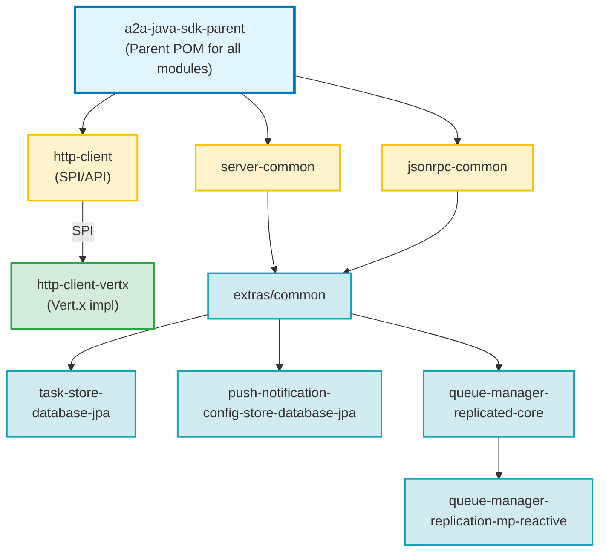

# A2A Java SDK - Extras

This directory contains optional extensions to the A2A Java SDK that enhance the default implementations with production-ready capabilities.

## Overview

The default A2A SDK uses in-memory storage and JDK HttpClient for simplicity. The extras modules provide drop-in replacements for production deployments that require:

- **High-Performance HTTP**: Non-blocking, event-loop based HTTP client (Vert.x)
- **Data Persistence**: Survive application restarts without losing tasks or configurations (JPA)
- **Horizontal Scaling**: Support multiple server instances with event replication (Kafka/Pulsar/AMQP)

All extras modules are designed as **drop-in replacements** using CDI priority annotations or SPI, requiring only dependency addition and configuration - no code changes needed.

## Multi-Module Maven Project Structure

```
extras/
├── common/                         # Shared event classes and utilities
├── http-client-vertx/              # Vert.x HTTP client implementation (SPI)
├── task-store-database-jpa/        # JPA TaskStore implementation
├── push-notification-config-store-database-jpa/  # JPA PushNotificationConfigStore
└── queue-manager-replicated/       # Multi-instance event replication
    ├── core/                       # Core replication abstractions
    └── replication-mp-reactive/    # MicroProfile Reactive Messaging impl
```

### Module Dependencies



**Key Dependencies**:
- **`extras/common`**: Foundation module with shared event classes; no external dependencies
- **`http-client-vertx`**: SPI implementation that auto-discovers via `A2AHttpClientProvider`
- **`task-store-database-jpa`**: Depends on `server-common`, `jsonrpc-common`, and `extras/common`
- **`push-notification-config-store-database-jpa`**: Depends on `server-common` and `extras/common`
- **`queue-manager-replicated-core`**: Depends on `server-common`, `jsonrpc-common`, and `extras/common`
- **`replication-mp-reactive`**: Depends on `queue-manager-replicated-core` and MicroProfile Reactive Messaging

## Available Modules

### 1. [Vert.x HTTP Client](./http-client-vertx/README.md)

**What it does**: Replaces the default JDK `HttpClient` with a Vert.x WebClient-based implementation for non-blocking, event-loop based HTTP communication.

**Problem it solves**:
- JDK HttpClient uses blocking I/O which limits scalability
- Thread-per-request model inefficient for high-throughput scenarios
- Poor integration with reactive frameworks like Quarkus
- Limited connection pooling and circuit breaker support

**When to use**:
- Reactive applications using Quarkus or Vert.x
- High-throughput A2A client scenarios (thousands of concurrent tasks)
- Cloud-native deployments requiring efficient resource utilization
- Applications needing advanced HTTP features (retries, timeouts, circuit breakers)

**Key features**:
- **Automatic discovery via SPI** - just add dependency, no code changes
- Non-blocking, event-loop based architecture
- Efficient connection pooling and reuse
- SSE (Server-Sent Events) streaming support
- Compatible with Vert.x and Quarkus reactive programming models
- Configurable timeouts, retries, and connection limits

**How to use**:
```xml
<!-- Add dependency - automatic discovery via ServiceLoader -->
<dependency>
    <groupId>io.github.a2asdk</groupId>
    <artifactId>a2a-java-sdk-http-client-vertx</artifactId>
</dependency>
```

The Vert.x implementation is automatically discovered via Java's `ServiceLoader` mechanism. No code changes required!

---

### 2. [JPA Database TaskStore](./task-store-database-jpa/README.md)

**What it does**: Replaces the default `InMemoryTaskStore` with a JPA-based implementation that persists tasks to a relational database (PostgreSQL, MySQL, Oracle, etc.).

**Problem it solves**:
- In-memory storage loses all task data on application restart
- Cannot share task state across multiple server instances
- Limited by available memory for large numbers of tasks

**When to use**:
- Production deployments requiring task persistence across restarts
- Multi-instance deployments where task state must be shared
- Long-running tasks that need to survive server updates
- Compliance requirements for task history and audit trails

**Key features**:
- Drop-in replacement (just add dependency and configure database)
- Works with any JPA 3.0+ provider (Hibernate, EclipseLink, etc.)
- Compatible with Quarkus and Jakarta EE application servers
- Automatic schema generation and migration support
- Transaction-aware task state management

---

### 3. [JPA Database PushNotificationConfigStore](./push-notification-config-store-database-jpa/README.md)

**What it does**: Replaces the default `InMemoryPushNotificationConfigStore` with a JPA-based implementation that persists push notification configurations to a relational database.

**Problem it solves**:
- Push notification subscriptions are lost on application restart
- Cannot share notification configurations across server instances
- Clients must re-subscribe after every deployment

**When to use**:
- Production deployments with push notification support
- Multi-instance A2A servers sharing notification state
- Systems requiring durable client subscriptions
- Applications where notification reliability is critical

**Key features**:
- Drop-in replacement (just add dependency and configure database)
- Composite primary key support (taskId + configId)
- Works with any JPA 3.0+ provider
- Survives application restarts and redeployments
- Shared state across multiple server instances

---

### 4. [Replicated Queue Manager](./queue-manager-replicated/README.md)

**What it does**: Replaces the default `InMemoryQueueManager` with a replicated implementation that synchronizes events across multiple A2A server instances using message brokers (Apache Kafka, Pulsar, AMQP).

**Problem it solves**:
- Events generated in one server instance are invisible to others
- Cannot horizontally scale A2A servers while maintaining event consistency
- No coordination between distributed A2A instances serving the same agent
- Task state changes not propagated across cluster nodes

**When to use**:
- **Required** when deploying multiple instances of the same A2A agent
- High-availability deployments with load balancing
- Cloud-native deployments requiring horizontal scaling
- Distributed systems where events must be synchronized
- Microservices architectures with event-driven coordination

**Key features**:
- Event replication via Apache Kafka (primary), Pulsar, or AMQP
- Pluggable replication strategies via `ReplicationStrategy` interface
- Transaction-aware "poison pill" mechanism for clean queue termination
- Automatic serialization/deserialization with type preservation
- Kafka partitioning by taskId for scalability and ordering guarantees
- Configurable grace period for handling late-arriving events
- MicroProfile Reactive Messaging integration (provided implementation)
- Custom replication strategies supported

**Architecture**:
- **Core Module**: `queue-manager-replicated-core` (required)
- **Replication Strategy**: `queue-manager-replication-mp-reactive` (MicroProfile implementation)
- Extensible design: implement your own `ReplicationStrategy` for custom backends

---

## Module Comparison

| Feature | InMemory (Default) | Vert.x HTTP Client | Database (JPA) | Replicated Queue |
|---------|-------------------|-------------------|----------------|------------------|
| **Performance** | Fast | Very Fast (reactive) | Good | Good |
| **Persistence** | No | N/A | Yes | No* |
| **Multi-Instance Support** | No | Yes | Yes | Yes |
| **Horizontal Scaling** | No | Yes | Limited** | Yes |
| **Production Ready** | Development only | Yes | Yes | Yes |
| **Additional Infrastructure** | None | None | RDBMS | Message Broker |
| **Configuration Complexity** | Minimal | Minimal | Low | Medium |

\* Replicated Queue Manager focuses on event synchronization. Use with JPA TaskStore for full persistence.
\** Database provides shared state but lacks event coordination across instances.

## Recommended Combinations

### Development / Testing
```xml
<!-- Use defaults - no extras needed -->
```

### Production - Single Instance with High Performance
```xml
<!-- Reactive HTTP client -->
<dependency>
    <groupId>io.github.a2asdk</groupId>
    <artifactId>a2a-java-sdk-http-client-vertx</artifactId>
</dependency>

<!-- Persistence -->
<dependency>
    <groupId>io.github.a2asdk</groupId>
    <artifactId>a2a-java-extras-task-store-database-jpa</artifactId>
</dependency>
<dependency>
    <groupId>io.github.a2asdk</groupId>
    <artifactId>a2a-java-extras-push-notification-config-store-database-jpa</artifactId>
</dependency>
```

### Production - Multi-Instance / High Availability
```xml
<!-- Reactive HTTP client -->
<dependency>
    <groupId>io.github.a2asdk</groupId>
    <artifactId>a2a-java-sdk-http-client-vertx</artifactId>
</dependency>

<!-- Task and config persistence -->
<dependency>
    <groupId>io.github.a2asdk</groupId>
    <artifactId>a2a-java-extras-task-store-database-jpa</artifactId>
</dependency>
<dependency>
    <groupId>io.github.a2asdk</groupId>
    <artifactId>a2a-java-extras-push-notification-config-store-database-jpa</artifactId>
</dependency>

<!-- Event replication across instances -->
<dependency>
    <groupId>io.github.a2asdk</groupId>
    <artifactId>a2a-java-queue-manager-replicated-core</artifactId>
</dependency>
<dependency>
    <groupId>io.github.a2asdk</groupId>
    <artifactId>a2a-java-queue-manager-replication-mp-reactive</artifactId>
</dependency>
```

## Getting Started

Each module contains its own detailed README with:
- Quick start guides
- Configuration examples for Quarkus and Jakarta EE
- Database schema details (for JPA modules)
- Message broker setup (for replicated queue)
- Production considerations
- Troubleshooting tips

Click the module names above to view detailed documentation.
